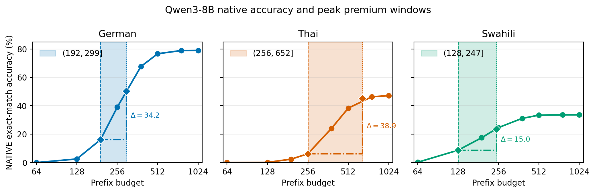

# Mind the Cap: Output-Budget Regimes Change the Measured Multilingual Reasoning Gap

---

## Abstract

Multilingual evaluations report accuracy at a single output-token cap, but languages need different numbers of tokens to express the same content. The cap is therefore a hidden experimental variable. We test whether the native-vs-translate gap on MGSM (German, Thai, Swahili) is a token-budget artifact for Qwen3-8B and Llama-3.1-8B-Instruct under four prompting strategies. The measured gap moves by up to 38.9 points across budgets, and at tight caps length normalization can reverse which strategy scores higher. We pre-registered the sweep's three Qwen peaks and its near-zero value at 1024 and evaluated them on 540,000 independently hard-capped decodes. A second frozen family of six Holm-corrected tests rejects every null. The prospectively frozen test at \(B^*=1024\) still fails to reject because native accuracy has already saturated there. Above saturation, the residual difference is a strategy-performance gap, not an identified reasoning deficit. The same truncation channel prices a cost-ordered adaptation ladder: a cross-fitted Thai vocabulary extension closes 0.00 points of the gap at the frozen budget and 4.9 points where 19% of traces still truncate. A third frozen family varies only the *announced* budget at a fixed enforced cap. Announcing 128 rather than 2048 tokens moves Thai native accuracy by 5.1 points, so accuracy is not a function of the enforced cap alone. Answer-emission timing accounts for where the artifact sits: with \(G(t)\) the probability that a trace is correct and has emitted its answer by \(t\), Equation (1) gives \(\Delta_L(B)=G(\lfloor rB\rfloor)-G(B)\) from one long-cap run. This matches the three pre-registered MGSM peaks to 0.65 points and, on three further benchmarks, tracks held-out items to 0.92 points while locating the peak exactly in five of seven Qwen cells. Treat the output cap as an independent variable and report accuracy across the budget regime, not at a single budget.

---

## 1. Introduction

A recurring finding in multilingual LLM evaluation is that models solve reasoning problems better when the problem is first translated into English than when they reason in the original language. This "multilingual reasoning gap" is usually measured at one generation length. Languages differ in how many tokens they need to express parallel content, and strategies differ in when they emit their answer. Under a hard output cap, both features interact with the cap in ways that can resemble a strategy-performance difference.

We ask a narrow, falsifiable question: is the native-vs-translate gap on MGSM a token-budget artifact? We operationalize a budget artifact as the change in that gap between a token-matched cap and a length-normalized, FLORES-200-premium-adjusted cap. If giving NATIVE its premium-scaled allowance closes the gap, token matching contributed to the measured difference; if the gap persists, this particular correction does not explain it.

Our contribution is methodological:

1. The answer can depend strongly on the evaluation budget. We pair a prospectively frozen non-rejection at one budget with a retrospective sweep that localizes the budget-binding regime, then replicate that budget dependence under a pre-registered held-out design in which every budget is decoded under its own hard cap.
2. Under tight caps, length normalization can reverse which strategy looks better, and announcing a budget changes behavior even when the enforced cap is held fixed.
3. Five ledger-computable audits - trace-language ID, COMET translation quality, parser robustness, decoder parity, and normalizer sensitivity - delimit which interpretations survive.
4. The same truncation channel prices a cost-ordered adaptation ladder: a directly measured, cross-fitted vocabulary extension closes the gap only where the cap still truncates.

Prompt language, reformulation, answer-format compliance, translation quality, and reasoning-trace language are confounded in this design. The object of inference is therefore strategy performance under controlled prefix budgets, not causal reasoning ability.

## Related Work

This study connects multilingual chain-of-thought evaluation on MGSM (Shi et al., 2023) with work on test-time compute, output budgeting, and budget-forcing, including s1 (Muennighoff et al., 2025). Our length proxy follows the FLORES parallel-text lineage and NLLB's FLORES-200 benchmark (Goyal et al., 2022; NLLB Team, 2022), while the measurement checks use GlotLID (Kargaran et al., 2023) and COMET (Rei et al., 2022). Cross-lingual tokenization disparities make output length a language-specific computational cost (Ahia et al., 2023; Petrov et al., 2023). We study how a prefix budget changes a multilingual strategy contrast after language-length normalization. A common response is to extend the vocabulary with target-language pieces and continue pretraining (Cui et al., 2023; Fujii et al., 2024). Principled initialization of the new embeddings is one refinement (Dobler & de Melo, 2023), and §5 prices that intervention against our estimand.

Truncated-reasoning work shows model- and modality-dependent accuracy losses under token ablation (Broken Chains) and trains recovery from partial traces (TRSD), which could shrink the budget-binding regime. Multilingual work reports both gains and off-target drift from English pivots (MMATH) and identifies input comprehension as a major loss source (UST). Training-side methods shrink native-pivot gaps to roughly 2-3.5% under matched supervision (Layer Swap) and produce self-distillation gains that grow with budget (COPSD). Our contribution is orthogonal: a budget-sweep protocol under which such training-side methods should be evaluated.

## 2. Design and estimands

Data and strategies. MGSM has 250 items per language in German (de), Thai (th), and Swahili (sw). We evaluate four strategies. NATIVE reasons and answers in language \(L\). TRANSLATE-ACT translates the problem to English, then solves it. PIVOT reasons in English and answers in \(L\). CODE-SWITCHED uses an English scaffold. We draw \(k=8\) samples per item from Qwen3-8B (confirmatory) and Llama-3.1-8B-Instruct (secondary, not a replication), for 48,000 stored generations.

Prefix-defined budgets. Each (item, sample) has one stored 4096-token generation. Evaluating budget \(B\) means scoring its length-\(B\) prefix. This removes between-frame sampling noise but limits conclusions to prefix-defined evaluation. The retrospective regime sweep uses \(B \in \{64,128,192,256,384,512,768,1024\}\); 2048 and 4096 are added only for extended crossover and best-arm checks.

Independent decoding. Hard-capped decodes separate budget effects from the shared trajectory in prefix scoring. The stored ledger supplies pre-registered point predictions for a fresh confirmation sample; peak budgets are fixed from discovery rather than re-selected. The sample contains 540,000 decodes in 270 cap-partitioned shards of 2,000 records, covering both models, all four arms, three languages, and \(k=8\). It evaluates \(B \in \{64,128,192,256,384,512,768,1024,2048\}\) and the premium-scaled NATIVE caps \(\lfloor r_{m,L}B\rfloor\). Seeds vary by cap, no two budgets replay one trajectory, and no trace exceeds its cap.

Scoring. We use strict prefix-only exact match on `#### <integer>` under intention to treat; truncated, non-integer, and non-compliant answers score 0. Each of the eight samples per item is scored independently at every budget, rather than by best-of-\(k\), pass@\(k\), or majority vote. Accuracy averages all item-sample cells, and the item-clustered bootstrap resamples 250 items while retaining all eight samples per selected item.

Estimand. Let \(\operatorname{gap}(B)=\operatorname{acc}_T(B)-\operatorname{acc}_N(B)\), and let \(r_{m,L}\) be the FLORES-200 token premium of language \(L\) over English for model \(m\). Then

\[
\begin{aligned}
\Delta_L(B)
&= [\operatorname{acc}_T(B)-\operatorname{acc}_N(B)]
 - [\operatorname{acc}_T(B)-\operatorname{acc}_N(\lfloor r_{m,L}B\rfloor)] \\
&= \operatorname{acc}_N(\lfloor r_{m,L}B\rfloor)-\operatorname{acc}_N(B).
\end{aligned}
\]

TRANSLATE-ACT cancels. What remains is how many more NATIVE answers become correct between the matched budget \(B\) and the premium-scaled budget \(\lfloor r_{m,L}B\rfloor\). We call a budget *binding* when correct answer lines are still appearing inside that window, and the *budget-binding regime* is the range of \(B\) over which they are.

This identity has three direct consequences. First, \(\Delta_L(B)\) is a finite, discrete increment of the NATIVE accuracy curve, not a comparator interaction. Second, its peak location follows the NATIVE answer-emission distribution, while its height depends on the premium-scaled window and the native curve inside that window. Third, \(\Delta_L(B)\to0\) once NATIVE accuracy stops rising with the budget; above that point, which we call *score saturation*, a near-zero value follows analytically from the estimand.

Primary test. The frozen evaluation budget is \(B^*=1024\), the largest \(B\in\{512,1024\}\) with every \(\lfloor r_{m,L}B\rfloor\le4096\). The confirmatory family contains six Holm-corrected Qwen tests: H1-existence, directional H1-SESOI (\(\Delta_L(B^*)>5\) points), H2, and H3 for three languages. Inference uses an item-clustered paired bootstrap (10,000 resamples), a studentized sup-\(t\) maximum statistic, and a pre-specified 1.3x tail-conservatism factor. The exploratory two-sided equivalence statement below is separate. The protocol was frozen at git tag `protocol-freeze` before confirmatory scoring; it is an internal freeze, not a public preregistration.

FLORES-200 premiums are Qwen de 1.56 / th 2.55 / sw 1.94 and Llama de 1.58 / th 2.19 / sw 1.93. Each is the model-tokenizer-specific total-token ratio to parallel English over 1,012 NFC-normalized FLORES-200 devtest sentence pairs, with a paired percentile bootstrap over pairs.

## 3. Regime-dependent results

### 3.1 The frozen test yields no confirmatory support

At \(B^*=1024\), \(\Delta_L(B^*)\) is near zero for every Qwen language, and all six Holm-family tests fail to reject (formal outcome `no_confirmatory_h1_support`):

- Qwen \(\Delta_L(B^*)\): de 0.00, th 0.15, sw 0.05 points. H1-existence raw \(p=0.060\) at Holm-local \(\alpha=0.0083\); H1-SESOI raw \(p=1.0\).
- Llama \(\Delta_L(B^*)\): de/th/sw all 0.00. This procedurally matched secondary analysis is outside the confirmatory family and also rejects nothing.

The two non-rejections have different descriptive causes. Qwen NATIVE accuracy plateaus at 79.0% / 47.1% / 33.7% for de/th/sw; between 1024 and the Thai FLORES cap of 2611, only 3 of 2000 traces become newly correct. Llama NATIVE instead plateaus near floor at 13.6% / 3.9% / 29.0%, alongside never-emission rates of 80.2% / 93.2% / 46.0%. Thus Qwen reaches score saturation at moderate accuracy, whereas Llama de/th often never produces a parseable native answer. Neither pattern implies that all traces have terminated.

### 3.2 Tight budgets expose a large, then vanishing, artifact

The retrospective sweep places the largest \(\Delta_L(B)\) inside the budget-binding regime (pointwise item-clustered bootstrap 95% CIs):

| model/lang | replay peak \(\Delta_L(B)\) (pts) | independent \(\Delta_L(B)\) | peak \(B\) | NATIVE acc. at \(B\) | TRANSLATE-ACT acc. at \(B\) | \(\Delta_L(512)\) | \(\Delta_L(1024)\) |
|---|---:|---:|---:|---:|---:|---:|---:|
| Qwen de | 34.2 [30.2, 38.3] | 34.65 | 192 | 16.10 | 22.60 | 2.25 | 0.00 |
| Qwen th | 38.9 [34.7, 43.0] | 38.60 | 256 | 6.20 | 47.75 | 8.85 | 0.15 |
| Qwen sw | 15.0 [12.4, 17.7] | 13.70 | 128 | 8.70 | 0.60 | 0.25 | 0.05 |
| Llama de | 8.4 [7.0, 9.9] | 8.50 | 256 | 3.85 | 43.10 | 0.15 | 0.00 |
| Llama th | 2.3 [1.6, 3.1] | 2.10 | 192 | 1.10 | 16.90 | 0.15 | 0.00 |
| Llama sw | 18.2 [15.9, 20.6] | 17.65 | 256 | 8.25 | 44.60 | 1.60 | 0.00 |

The independent column is the same estimand measured on the confirmation sample of §2, evaluated at the discovery peak budget rather than at a re-selected argmax.

Qwen German at \(B=192\) is the cleanest peak: both arms have nontrivial token-frame accuracy (16.10% vs 22.60%), while premium-scaling raises NATIVE by 34.2 points. Thai's 38.9-point peak is amplified by the largest premium, \(r=2.550777\): the native cap is 652, so \(\Delta_L(256)\) summarizes gain across the 396-token window \((256,652]\), not a contrast at equal output widths. Qwen Swahili's peak occurs with TRANSLATE-ACT at only 0.60%, so it demonstrates a native-prefix rescue but is not a clean two-arm comparison away from floor. The same caution applies to the German crossover at \(B=128\) (§3.3).

Across the sweep, max-\(|t|\) simultaneous 95% bands keep every Qwen peak away from zero: de@192 [27.8, 40.6], th@256 [32.3, 45.4], sw@128 [10.7, 19.3]. Peak locations are stable in 89.6%, 100.0%, and 87.9% of bootstrap replicates. At \(B^*\), the largest language-specific upper bound is 0.32 points for Qwen and 0.00 for Llama, below the exploratory +/-5-point equivalence margin.

**The peaks survive independent capping.** The confirmation sample has its own frozen family of six Holm-corrected Qwen tests: three one-sided SESOI tests that \(\Delta_L(B)>5\) points at the discovery peak budget, and three two-one-sided equivalence tests that \(|\Delta_L(1024)|<5\). All six reject at family-wise \(\alpha=0.05\) (formal outcome `confirmatory_support`). The independent peak estimates are 34.65 points for German at \(B=192\), 38.60 for Thai at 256, and 13.70 for Swahili at 128. Their standard errors are 2.10, 2.26, and 1.37, with \(p=0.0001\) throughout; each estimate lies inside its discovery interval. At \(B^*=1024\), the equivalence estimates are 0.15, -0.25, and -1.25 points, and the largest of their three p-values is 0.0003. The independent argmax also falls on the predicted budget in all three Qwen languages. This second frozen family does not alter the non-rejection of the \(B^*=1024\) family in §3.1. Instead, it rules out shared prefix trajectories as the source of the tight-budget magnitudes.

Llama remains outside the confirmatory family and supports no confirmatory claim. Its independent estimates at the discovery peaks are 8.50 points for German, 2.10 for Thai, and 17.65 for Swahili, against discovery values of 8.35, 2.30, and 18.20. The Thai SESOI test does not reject: a discovery estimate of 2.30 points cannot clear a 5-point SESOI. Llama German and Thai each shift their argmax by one grid point, and those cells are too flat to fix a location; Thai reads 2.20, 2.30, and 2.00 at 128, 192, and 256. Independently decoded output-length distributions match the truncated discovery distributions to a median 0.11% of the cap for Qwen and 0.16% for Llama.

**Normalizer sensitivity and adverse signal.** All six behavioral trace-ratio-minus-FLORES differences are negative with non-overlapping pointwise intervals: Qwen de -0.092 [-0.144, -0.028], th -0.513 [-0.588, -0.440], sw -0.757 [-0.824, -0.685]; Llama de -0.149 [-0.193, -0.099], th -0.427 [-0.488, -0.365], sw -0.083 [-0.129, -0.021]. FLORES therefore consistently grants a larger premium than this behavioral diagnostic. Substituting the behavioral ratio would still produce a 5-point artifact in four of the six cells. For Qwen de and th, the minimum evaluated premiums producing a 5-point artifact, 1.089 and 1.188, remain below the behavioral ratios 1.467 and 2.038. For Llama, the corresponding thresholds are 1.274 for de and 1.253 for sw, both below behavioral ratios 1.432 and 1.848. Qwen Swahili is the exception: its threshold 1.254 sits above the behavioral ratio 1.179, so substituting that ratio would not produce a 5-point artifact. The 5-point Swahili claim therefore depends on a premium above the behavioral ratio, including the frozen FLORES prose premium. Llama Thai never reaches 5 points, even up to 1.5x FLORES. These grid-selected thresholds are conditional on the stored traces. The behavioral ratio is not a validated normalizer, because it compares traces with different content, correctness, and stopping behavior.

*Figure 1. Qwen NATIVE token-frame accuracy by budget. Shading marks each language's peak window \((B_{\mathrm{peak}},\lfloor rB_{\mathrm{peak}}\rfloor]\), the interval whose native accuracy increment equals the reported peak \(\Delta_L(B)\).*

### 3.3 Tight caps can reverse strategy rankings

Qwen crossover strength follows the left tail of answer-emission timing more closely than the medians:

| lang | NATIVE median \(E\) | TRANSLATE-ACT median \(E\) | NATIVE p10 \(E\) | TRANSLATE-ACT p10 \(E\) | observed crossover |
|---|---:|---:|---:|---:|---|
| sw | 206 | 262 | 96 | 170.7 | strongest: NATIVE leads at 64/128/192 |
| de | 270 | 247 | 160 | 158 | marginal: NATIVE leads at 128 |
| th | 377 | 250 | 236 | 165 | none |

TRANSLATE-ACT's median emission is earlier than NATIVE's in German and Thai. The p10 ordering is timing-consistent with the crossover. Swahili has a 74.7-token NATIVE early-tail advantage and the strongest native lead. German differs by only 2 tokens and has a narrow lead, and Thai NATIVE is 71 tokens later and never leads. These grid-resolved emission summaries do not isolate translation-segment length or establish mediation.

At \(B=128\), Qwen German NATIVE scores 2.55% versus 1.15% for TRANSLATE-ACT; Swahili NATIVE leads with bootstrap probability 1.00 at 128 and 192 (transition [192,256]), while German leads with probability 0.958 at 128 (transition [128,192]). Thai has no native lead. No Llama language crosses because native accuracy remains near floor. The Qwen Swahili crossover also comes from a degenerate heavy-tail cell: NATIVE output-length p90 is 4096 and 25.1% never emit a parseable answer. The frozen H3 test missed these reversals because it examined only the looser registered budgets.

A sharper consistency check uses the correct-emission sub-CDF \(G(t)=P(C=1,E\le t)\), where \(C\) is completed-trace correctness. Equation (1) gives \(\Delta_L(B)=G(\lfloor rB\rfloor)-G(B)\) from one long-cap NATIVE ledger. This is a consistency check, not a test. For the three Qwen MGSM peak cells, predictions against independent-decoding outcomes have mean absolute error 0.65 points (Appendix I). Across three added benchmarks, an exploratory Qwen-only, item-level split-half analysis in the replay frame has MAE 0.92 points on held-out items and locates the peak exactly in five of seven cells (Appendix I).

### 3.4 Announcing the budget changes behavior

The budget sweeps enforce but do not disclose the cap: `max_tokens` stops decoding and does not enter the prompt. A separate frozen family holds the enforced cap at a non-binding 2048 and varies only the *announced* number over {128, 256, 2048}. Its 876,000 records therefore isolate disclosure from truncation. The confirmatory family contains four two-sided announcement dose contrasts on Qwen3-8B: NATIVE and TRANSLATE-ACT crossed with German and Thai. Tests are Holm-corrected at family-wise \(\alpha=0.05\), with first-step local \(\alpha_1=0.0125\) (Appendix G).

One cell rejects, and the formal outcome is `announcement_effect_detected`. Thai NATIVE scores 63.20% when 128 is announced against 58.10% when 2048 is, a difference of \(+5.10\) points (SE 1.67, \(p=0.0029\)), and the announced grid is monotone: 63.20, 59.90, 58.10 at 128, 256 and 2048. German NATIVE moves 2.85 points the other way and does not clear its local threshold (\(p=0.0380\)). Announcing a tighter budget therefore *raised* accuracy in the one cell that rejects. That is one cell, one model and one benchmark, and we report it as such rather than as a direction.

Two exploratory results bound the mechanism. A machine-readable `TOKEN_BUDGET: {budget}` tag is inert in all twelve cells, moving median length by 0.2-2.2% and rejecting nowhere. Forcing - injecting the answer delimiter when the cap arrives - instead lifts Qwen NATIVE German at \(B=128\) from 2.55% to 25.70%, a pooled figure over two populations we keep separate because their average means little: 23.72% among traces the cap truncated and 100% among traces that ran to completion without emitting an answer line.

## 4. Measurement audits

We report five ledger audits and one diagnostic. Trace-language ID, COMET, parser robustness, and decoder parity appear below; normalizer sensitivity appears in §3.2. The verbosity/failure-tail decomposition is a diagnostic, not a sixth audit.

**Trace-language ID (automated GlotLID).** Determinate NATIVE traces are classified in \(L\) at Qwen de 92.1% / sw 94.1% / th 99.4% and at 100% for all Llama languages. TRANSLATE-ACT post-delimiter reasoning is 98.4-99.9% English. A `swh`-only mapping yields 75% agreement, below the frozen 90% native:sw criterion. The linguistically correct Swahili macrolanguage mapping (`swh` + `swc`, with `swc` denoting Congo Swahili) raises Qwen native-Swahili compliance from 85.8% to 94.1% and the validation cell to 90.00% (18/20). Because this mapping was adopted after inspecting the failed criterion, we treat it as a post-hoc analytic decision. Unrelated neighboring Bantu labels remain outside Swahili. An independent blind LLM adjudication of 240 Qwen traces agrees at 96.7% overall and at least 90% in every cell, but the frozen human validation remains outstanding. PIVOT and CODE-SWITCHED violate their English instruction in 9 of 12 cells, so they remain outside the main comparison.

**COMET translation quality.** Reference-based COMET means for TRANSLATE-ACT are Qwen de 0.877 / th 0.858 / sw 0.749 and Llama de 0.872 / th 0.783 / sw 0.798 (Appendix E). Quality is generally high but nonuniform: Qwen Swahili is lowest, and Llama Thai has p10 0.325. At the six prespecified peak budgets, exploratory per-cell COMET-correctness-gain correlations are weak and inconsistent (Spearman \(\rho=-0.143\) to \(0.280\), five positive, only one with \(|\rho|\ge0.20\)), so translation quality does not consistently explain the tight-budget TRANSLATE-ACT advantage. These scores never condition accuracy.

**Parser robustness.** In NATIVE peak cells, prefix-only rescued-correct traces are at most 0.35% and value-unstable traces at most 0.30%. Within the \((B,\lfloor rB\rfloor]\) windows, 96.8-100% of native gains are genuinely terminated. Requiring a terminated answer line changes every peak by at most 0.2 points (Qwen de 34.2->34.0, th 38.9->38.9, sw 15.0->15.1; Llama sw 18.2->18.4). The tight-budget effect is therefore late answer emission rather than a prefix-parser artifact.

**Decoder parity.** A stratified 2,520-prefix audit finds 37.9% raw exact-string agreement between local and vLLM decoding but 100% agreement after production special-token normalization, including 100% parsed-answer and correctness agreement. All raw divergences are cosmetic special-token markup.

**Verbosity/failure-tail diagnostic.** Qwen Swahili NATIVE has a heavy tail: 10.6% hit the 4096 cap and 25.1% never emit a parseable answer. This mixes truncation, non-integer or multiple answers, and format noncompliance, cautioning against interpreting native accuracy as pure reasoning ability.

**Instrument validity.** A null is interpretable only if the announcement changes behavior. The 30% median-length-reduction gate excludes both TRANSLATE-ACT cells under instrument v0, at 14.6% for German and 10.1% for Thai, so those nulls are uninformative. The translation segment remains at 57 tokens in German and 76 in Thai across announcements. Under instrument v1, total responses reach 34.4% and 37.5%, and the estimates are \(-2.60\) (\(p=0.0229\)) and \(-2.30\) (\(p=0.0662\)). No Holm decision or formal outcome changes, but both nulls become interpretable (Appendix H). Llama fails the gate in all four cells under both instruments, at 2.4-9.3% against Qwen's 34-43%; every Llama estimate is therefore uninformative about budget sensitivity, including the two that reject. Llama carries no confirmatory claim.

## 5. Implications for adaptation

A natural response to a measured multilingual gap is a cost-ordered ladder of fixes: raise the serving budget, then change the prompting strategy, then add language-specific tokens to the tokenizer, and finetune only if all three fail. Our ledger prices the two token-count rungs.

**Both token-count rungs act only by relieving truncation.** A larger cap and a cheaper tokenizer both change one thing: how much of the trace the model is allowed to finish. Where the trace already fits, neither can change an answer. Writing \(\rho\) for the factor by which an extension shortens target-language text, a NATIVE-only payoff \(\operatorname{acc}_N(\lfloor\rho B\rfloor)-\operatorname{acc}_N(B)\) has exactly the form of Equation (1) with \(\rho\) in place of \(r_{m,L}\). We use that only as motivation and measure the effect directly, because compression is not uniform across traces and a deployed extension changes both arms.

**Measured vocabulary extension.** We extend Qwen tokenizers without changing the base vocabulary or merge list (Appendix F). Stored traces are retokenized, decoded to their first \(B\) extended token ids, and scored with the strict parser; the baseline uses the same computation with the base tokenizer. Extensions are cross-fitted over two disjoint item halves, so no evaluated item contributes a merge. They add roughly 3.4k / 6.7k / 3.1k tokens for de/th/sw and reduce the FLORES-200 devtest premium from 1.559 to 1.531, 2.551 to 2.207, and 1.936 to 1.846. The aggregate English devtest token count changes by less than 0.02%. No model weights are trained.

| lang | B | NAT trunc | NAT gain to 4096 | G | G(4096) | G3 (vocab) | gap closed by vocab [95% CI] |
|---|---:|---:|---:|---:|---:|---:|---|
| de | 128 | 97.1% | 76.45 | -1.40 | +9.40 | -2.30 | +0.90 [-0.05, 1.85] |
| de | 256 | 52.1% | 40.00 | +10.25 | +9.40 | +9.05 | +1.20 [-0.25, 2.65] |
| de | 512 | 3.9% | 2.35 | +10.95 | +9.40 | +10.45 | +0.50 [0.05, 1.10] |
| de | 1024 | 0.2% | 0.00 | +9.35 | +9.40 | +9.35 | +0.00 [0.00, 0.00] |
| th | 128 | 99.9% | 47.10 | +0.75 | +40.60 | -0.10 | +0.85 [0.20, 1.65] |
| th | 256 | 84.7% | 41.05 | +41.55 | +40.60 | +38.15 | +3.40 [1.90, 5.00] |
| th | 512 | 18.9% | 8.90 | +48.40 | +40.60 | +43.50 | +4.90 [3.65, 6.20] |
| th | 1024 | 0.7% | 0.15 | +40.75 | +40.60 | +40.75 | +0.00 [0.00, 0.00] |
| sw | 128 | 81.5% | 25.05 | -8.10 | +23.30 | -9.40 | +1.30 [0.75, 1.90] |
| sw | 256 | 42.6% | 9.00 | +5.00 | +23.30 | +4.35 | +0.65 [-0.20, 1.55] |
| sw | 512 | 15.3% | 0.35 | +22.75 | +23.30 | +22.80 | -0.05 [-0.25, 0.15] |
| sw | 1024 | 11.6% | 0.10 | +23.40 | +23.30 | +23.35 | +0.05 [0.00, 0.15] |

Three patterns cut against the monotone \(G>G_1>G_2>G_3\) expectation.

First, **more budget need not shrink the gap**. At \(B=128\) the measured deficit is negative in German and Swahili and near zero in Thai, because TRANSLATE-ACT has not finished its translation preamble. A gap measured under a tight cap can therefore carry the wrong sign — though these near-floor cells are an exploratory sign instability, not a calibrated estimate of harm.

Second, **vocabulary extension captures only a fraction of what a larger cap would**. The informative comparison is the NATIVE accuracy a longer prefix actually recovers, \(\operatorname{acc}_N(4096)-\operatorname{acc}_N(B)\). Against that, the extension's own NATIVE gain is 3.45 of 40.00 points (German, \(B=256\), 9%), 5.20 of 41.05 (Thai, 13%), rising to 5.05 of 8.90 (Thai, \(B=512\), 57%). Where the longer prefix recovers nothing, the extension does too.

Third, **the residual gap is the whole gap**. At the largest stored prefix 9.4 / 40.6 / 23.3 points remain, and the prompting rung cannot be priced because adopting TRANSLATE-ACT closes \(G\) by construction.

The practical guidance is narrow. Before paying for either token-count rung, measure the realized gain directly: extend the cap on a sample and see how much accuracy the longer prefixes recover. Where that gain is small, neither rung is likely to pay however many traces truncate, though that is dispositive only if the extended cap is itself non-binding, which ours is not. Where the gain is large, raising the cap dominates for native accuracy but not necessarily for the gap, since a larger cap lifts TRANSLATE-ACT too. This is a triage heuristic derived from our estimand, not a validated adaptation method.

One further scope condition attaches to it. Reading a realized gain off a cap extension presupposes that \(\operatorname{acc}_N(B)\) is a function of \(B\) alone. Section 3.4 shows that it is not, once \(B\) is announced to the model: one enforced cap can yield different accuracy depending on what the prompt says about it, so a deployment that discloses its budget must run the triage under the disclosure it will ship with. This bounds where the heuristic applies. It does not disturb the truncation argument above, which quantifies over the cap and the tokenizer, and an announcement is neither.

## 6. Scope and implications

This study demonstrates that multilingual exact-match comparisons under hard output caps are regime-dependent: normalization matters in the budget-binding regime and becomes irrelevant after score saturation. The prospectively frozen non-rejection at \(B^*=1024\) is a negative boundary condition. The retrospective sweep localizes where the descriptive sensitivity occurs, and its six pre-registered cells then held on independently capped decodes (§3.2). The remainder of the sweep is still exploratory.

At the larger evaluated budgets the residual native-vs-translate difference is large (Qwen Thai +41 points, Llama Thai +69), but it is a strategy-performance gap. Prompt language, reformulation, format compliance, translation quality, and reasoning language remain confounded.

Calling the residual "not an identified reasoning deficit" describes what this design can identify, not an assertion that execution effects are absent: DATG finds target-language reasoning-execution failures even with English inputs.

Future work will test prompts that elicit earlier answer emission and extend the protocol to longer-form and non-numeric tasks. The full ledger of stored generations and all analysis code will be released.

Takeaway. When comparing language strategies under a token cap, treat the cap as an independent variable. Report accuracy across a budget sweep with a length-normalized frame, mark where answer emission binds, and do not let one budget carry the claim.

## Limitations

The three Qwen peak cells and the equivalence at \(B^*\) were pre-registered and confirmed on independently capped generations (§3.2). The rest of the sweep remains retrospective and exploratory: the crossovers in §3.3, grid points outside those six cells, and normalizer-sensitivity analysis. The announcement experiment isolates disclosure at a fixed cap; it does not test an announced budget that also binds, nor establish effects beyond Qwen, MGSM, and the announced values evaluated. The forcing results are exploratory. Under our serving stack `max_tokens` only stops decoding and never conditions the model: with a shared seed, 75% of capped decodes return bitwise identical to the truncated long decode. Separately, repeating an identical request was only 46% bitwise deterministic (23/50), which weakens reproducibility and shared-seed interpretation without changing the stored-ledger estimand.

The scope is MGSM, three languages, and two 8B models, plus exploratory Qwen-only consistency checks on three added benchmarks. This is not a general claim about multilingual reasoning. The frozen human GlotLID validation and same-content trace-premium validation remain outstanding; the preliminary blind LLM agreement and the behavioral ratio in Appendix C do not substitute for them. The vocabulary extension is a Qwen-only, token-count counterfactual on fixed emitted text, not a prediction for a retrained model. Its compression is specific to MGSM reasoning traces, its intervals condition on two fixed cross-fitted tokenizers, and \(G(4096)\) is the gap at the largest stored prefix rather than a demonstrated non-binding regime.

---

## Appendix

A. Full accuracy curves. Token-frame values by model, language, arm, and budget are in `analysis-out/explore_budget_{qwen,llama}.md`.

B. Best-English-arm. Reselecting the empirically best English arm inside each bootstrap replicate reproduces the preselected TRANSLATE-ACT gap closely (Qwen Thai 41 points, Llama Thai 69; uplift over TRANSLATE-ACT is near zero in most cells).

C. Trace-length ratio (not a normalizer). The ratio of median NATIVE output tokens to median TRANSLATE-ACT post-delimiter English-reasoning tokens is Qwen de 1.47 / th 2.04 / sw 1.18. It compares behaviorally different traces and cannot validate or replace FLORES.

D. Statistical machinery and the six-test family. See `prereg-matched-budgets.md` and `analysis-out/confirmatory_*.json`. The corrected type-I rate was 0.00917 against a 0.00833 target; the pre-specified 1.3x factor is the family-wide safeguard. The independent-decoding analysis has its own family of six tests, with results in `analysis-out/independent_scoring.json`. It reuses the same machinery, except that \(\operatorname{acc}_N(B)\) and \(\operatorname{acc}_N(\lfloor rB\rfloor)\) come from different generations and are paired within item rather than within trace.

E. TRANSLATE-ACT translation quality (COMET, descriptive). We use reference-based `Unbabel/wmt22-comet-da` on one stored full trace per item (sample 0). Traces missing the delimiter are excluded from this denominator only. Intervals are pointwise 95% item-bootstrap CIs (10,000 resamples).

| Model | Lang | n | Missing delimiter | COMET mean | median | p10 | p90 | 95% CI |
|---|---|---:|---:|---:|---:|---:|---:|---|
| Qwen | de | 250 | 0.0% | 0.877 | 0.878 | 0.834 | 0.921 | [0.872, 0.881] |
| Qwen | th | 249 | 0.4% | 0.858 | 0.866 | 0.810 | 0.907 | [0.851, 0.865] |
| Qwen | sw | 250 | 0.0% | 0.749 | 0.772 | 0.580 | 0.867 | [0.734, 0.763] |
| Llama | de | 249 | 0.4% | 0.872 | 0.874 | 0.826 | 0.915 | [0.868, 0.877] |
| Llama | th | 244 | 2.4% | 0.783 | 0.850 | 0.325 | 0.895 | [0.759, 0.805] |
| Llama | sw | 240 | 4.0% | 0.798 | 0.825 | 0.703 | 0.888 | [0.783, 0.811] |

These scores are descriptive only and never condition, gate, or reweight accuracy.

F. Vocabulary-extension measurement. We extend the Qwen3-8B byte-level BPE tokenizer without touching the base vocabulary or merge list: new merges learned on NATIVE-arm target-language traces are appended below every base merge, so base merges retain priority. Extensions are cross-fitted over two disjoint halves of the 250 MGSM items: each is trained on the NATIVE traces of the items it is *not* evaluated on, for both arms. The base pipeline reproduces the frozen premiums exactly (1.5589 / 2.5508 / 1.9363). Accuracy in §5 uses no \(\rho\) multiplier, and we decode token ids rather than slice the source string, because byte-level tokens can split a code point. That retokenization path agrees with the stored-token-id scorer on 59,998 of 60,000 sample-budget comparisons; the two exceptions are Swahili NATIVE traces whose text does not round-trip. No model weights are trained.

| Lang | Fold | New tokens | r (base) | r' (extended) | English control |
|---|---|---:|---:|---:|---:|
| de | 0 | 3,470 | 1.559 | 1.531 | 0.99996 |
| de | 1 | 3,343 | 1.559 | 1.532 | 0.99996 |
| th | 0 | 6,798 | 2.551 | 2.195 | 1.00000 |
| th | 1 | 6,577 | 2.551 | 2.218 | 1.00000 |
| sw | 0 | 3,173 | 1.936 | 1.865 | 0.99993 |
| sw | 1 | 3,054 | 1.936 | 1.826 | 0.99986 |

G. Budget announcement (E2).

All cells decode at a real cap of 2048 tokens; only the announced number varies. The analysis contains 876,000 records over 438 shards. The two-sided estimand is \(\Delta_{\mathrm{ann}} = \operatorname{acc}^{128}(2048)-\operatorname{acc}^{2048}(2048)\), with the same 1.3x tail-conservatism factor used elsewhere. The confirmatory family has four Qwen3-8B contrasts between announced 128 and announced 2048, Holm-corrected at family-wise \(\alpha=0.05\) (first-step local \(\alpha_1=0.0125\)). The announced-256 cell is an interpolation outside the family. Formal outcome: `announcement_effect_detected`.

| arm | lang | acc @128 | acc @2048 | \(\Delta\) | SE | p | reject |
|---|---|---:|---:|---:|---:|---:|---|
| NATIVE | de | 78.05 | 80.90 | -2.85 | 1.29 | 0.0380 | no |
| NATIVE | th | 63.20 | 58.10 | +5.10 | 1.67 | 0.0029 | **yes** |
| TRANSLATE-ACT | de | 87.15 | 87.80 | -0.65 | 0.69 | 0.4776 | no |
| TRANSLATE-ACT | th | 87.70 | 86.25 | +1.45 | 0.75 | 0.0747 | no |

Dose response over the announced grid (AWARE arm; median output tokens in parentheses):

| arm | lang | announced 128 | announced 256 | announced 2048 |
|---|---|---|---|---|
| NATIVE | de | 78.05 (177) | 77.20 (214) | 80.90 (292) |
| NATIVE | th | 63.20 (198) | 59.90 (239) | 58.10 (350) |
| TRANSLATE-ACT | de | 87.15 (222) | 87.15 (233) | 87.80 (260) |
| TRANSLATE-ACT | th | 87.70 (264) | 87.80 (269) | 86.25 (293) |

Only Thai NATIVE is monotone in the announced value across all three levels. Median lengths respond in every cell, which is what the instrument gate below checks.

The machine-readable `TOKEN_BUDGET: {budget}` tag arm is inert: median length moves by 0.2-2.2% across announced values and no contrast rejects in any of its twelve cells. Forcing is exploratory and separate. Injecting the answer delimiter when the cap arrives fires on 97.00% of Qwen NATIVE German decodes at \(B=128\), of which 99.74% were truncated, and lifts pooled accuracy from 2.55% (BLIND) to 25.70%. The pooled figure averages two populations that behave differently: 23.72% among traces the cap truncated (`capped_eos=false`) and 100.00% among traces that completed without emitting an answer line (`capped_eos=true`).

H. Instrument validity (E2b).

The four Qwen confirmatory cells use two announcement sentences. The family, estimand, announced values, enforced cap, and Holm structure are unchanged from Appendix G; only the TRANSLATE-ACT instruction differs. Instrument v0 reads "The translation, all of your reasoning and the final answer may take at most {budget} tokens in total." Instrument v1 reads "Your entire response must not exceed {budget} tokens. Keep the translation as short as possible, reason concisely, and write the #### line before you reach the limit." NATIVE is unchanged, so its repeated rows are one measurement, not a replication. The gate is a 30% median-length reduction between extreme announced values; failure makes an estimate uninformative rather than evidence of no effect.

| arm | lang | instrument | \(\Delta\) | SE | p | gate | gate result | reading |
|---|---|---|---:|---:|---:|---:|---|---|
| NATIVE | de | v0 | -2.85 | 1.29 | 0.0380 | 39.4% | PASS | informative |
| NATIVE | th | v0 | +5.10 | 1.67 | 0.0029 | 43.4% | PASS | informative |
| TRANSLATE-ACT | de | v0 | -0.65 | 0.69 | 0.4776 | 14.6% | FAIL | uninformative |
| TRANSLATE-ACT | th | v0 | +1.45 | 0.75 | 0.0747 | 10.1% | FAIL | uninformative |
| NATIVE | de | v1 | -2.85 | 1.29 | 0.0380 | 39.4% | PASS | informative |
| NATIVE | th | v1 | +5.10 | 1.67 | 0.0029 | 43.4% | PASS | informative |
| TRANSLATE-ACT | de | v1 | -2.60 | 1.09 | 0.0229 | 34.4% | PASS | informative |
| TRANSLATE-ACT | th | v1 | -2.30 | 1.17 | 0.0662 | 37.5% | PASS | informative |

No Holm decision changes between instruments, and the formal outcome is unchanged. What changes is the interpretation of the two TRANSLATE-ACT cells: under v0 they are uninformative, under v1 they are real nulls at the family threshold.

Under v0, the translation segment remains at 57 tokens in German and 76 in Thai across announced values (0.0% response). Under v1, it changes by 5.3% (de) and 16.0% (th), while the total median-length response is 34.1% for German and 36.8% for Thai, compared with 14.6% and 9.9% under v0.

Llama-3.1-8B-Instruct fails the gate in all four cells under both instruments, at 5.7% / 2.4% / 7.5% / 8.6% (v0) and 5.7% / 2.4% / 8.3% / 9.3% (v1), against Qwen's 34-43%. Every Llama estimate in this family is therefore uninformative about budget sensitivity, including its two rejections (NATIVE de -4.35 and NATIVE th +2.50), which we do not read as budget findings. Llama carries no confirmatory claim anywhere in the paper.

I. Correct-emission sub-CDF consistency check.

For NATIVE, define the correct-emission sub-CDF \(G(t)=P(C=1,E\le t)\), where \(E\) is answer-emission position and \(C\) is correctness of the completed trace. Under Equation (1),
\[
\Delta_L(B)=G(\lfloor rB\rfloor)-G(B).
\]
Both terms are estimated from the same stored 4096-cap ledger. The peak budgets were selected from the discovery sweep, so this three-cell comparison is exploratory. It is a consistency check, not a test.

| lang | window | observed independent \(\Delta_L(B)\) | sub-CDF prediction | error |
|---|---|---:|---:|---:|
| de | (192, 299] | 34.65 | 34.20 | -0.45 |
| th | (256, 652] | 38.60 | 38.85 | +0.25 |
| sw | (128, 247] | 13.70 | 14.95 | +1.25 |

The mean absolute error against independent-decoding outcomes is 0.65 points. The R1 standard errors are 2.10 / 2.26 / 1.37, making the absolute residuals 0.21 / 0.11 / 0.91 outcome SEs. Agreement with REPLAY deltas is not evidence: under absorbing correctness, the sub-CDF on a replay ledger is algebraically identical to the replay accuracy difference and therefore agrees by construction.

An exploratory replay-frame breadth analysis applies the same construction to Qwen3-8B NATIVE long-cap ledgers on three further benchmarks. Within each cell, \(G\) is estimated on even-indexed items and \(\Delta_L(B)\) is scored on odd-indexed items, making the halves disjoint. Same-item scoring would be circular: under absorbing correctness, \(G(\lfloor rB\rfloor)-G(B)\) is the prefix-scored accuracy difference itself, so agreement would be guaranteed.

| benchmark | lang | \(r\) | MAE | observed peak | predicted peak |
|---|---|---:|---:|---:|---:|
| MMATH | es | 1.522 | 1.77 | 20.65 @384 | 19.03 @256 |
| MMATH | th | 2.551 | 1.15 | 36.45 @384 | 35.95 @384 |
| Belebele | de | 1.559 | 0.67 | 40.31 @256 | 36.64 @256 |
| Belebele | th | 2.551 | 0.37 | 21.11 @384 | 21.39 @384 |
| Belebele | sw | 1.936 | 0.44 | 10.83 @64 | 12.53 @64 |
| Global-MMLU-Lite | de | 1.559 | 0.81 | 32.94 @384 | 31.81 @384 |
| Global-MMLU-Lite | sw | 1.936 | 1.22 | 7.50 @64 | 5.94 @128 |

Across these seven cells, the mean absolute error is 0.92 points on held-out items. Peak location is exact in five of seven; the other two differ by one grid point. This design differs from MGSM: there the predictor comes from the replay ledger and the outcome from a separately generated independent sweep, whereas here both halves come from one ledger. The 0.92 and 0.65 errors are therefore not like-for-like and do not establish a trend.

MMATH zh is separate and is not counted among the seven. Its premium is \(r=1.003\), so \((B,\lfloor rB\rfloor]\) is about one token wide and \(\Delta_L(B)\) is approximately zero throughout by construction (observed peak 0.14; MAE 0.05). This is a structural check that the estimand vanishes without a premium, not a successful prediction of the mechanism.

These results are Qwen-only and exploratory, use item-level split halves, and remain in the replay frame. Llama parse rates on these benchmarks ranged from 0.1% to 29%, producing one usable cell of eight. Its prose answers lack the required `####` form, and the required log-probability data were unavailable, so Llama could not be scored on these added benchmarks.

For MGSM, the naive factorization \(p_{\mathrm{correct}}\times[F_E(\lfloor rB\rfloor)-F_E(B)]\) predicts 30.41 / 36.69 / 10.53, for a mean absolute error of 3.10 points. It incorrectly assumes that correctness and emission time are independent. Of 6,000 records, 697 never emit a parseable answer at this analysis's probe resolution; these non-emitters are 0% correct by construction, against 60.3% correctness among emitters.

In MGSM, correctness is not strictly absorbing because `parse_answer` reads the last answer line. On the same ledger, genuine answer revision occurs in 1.35% of records and correct-to-wrong revision in 0.52%. Of apparent instability, 98% is the parser reading a number mid-write; this cannot bias \(\Delta_L(B)\) because such a prefix scores wrong under both frames.

The MGSM calculation covers only three Qwen3-8B cells and supports no claim across models or benchmarks.

